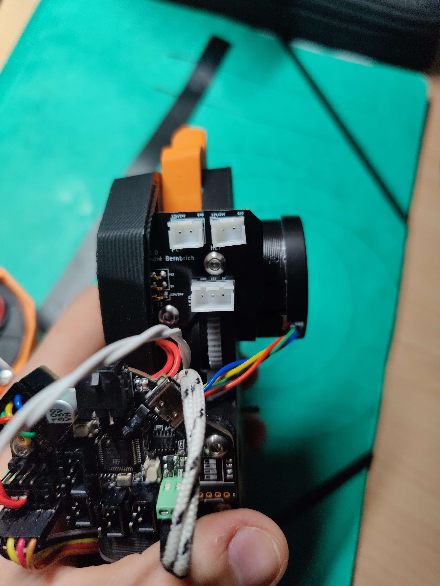
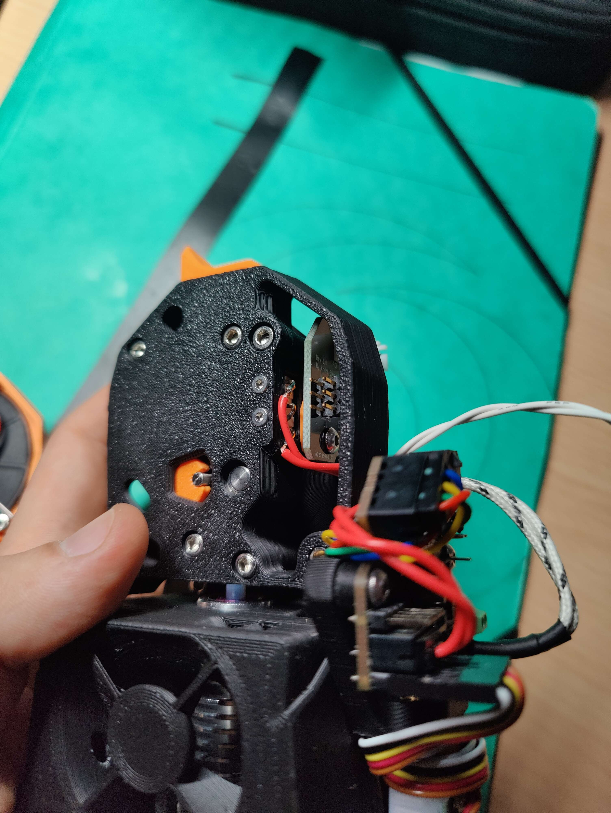

<!--
 Copyright (C) 2022 Chris Laprade (chris@rootiest.com)
 
 This file is part of CANburner.
 
 CANburner is free software: you can redistribute it and/or modify
 it under the terms of the GNU General Public License as published by
 the Free Software Foundation, either version 3 of the License, or
 (at your option) any later version.
 
 CANburner is distributed in the hope that it will be useful,
 but WITHOUT ANY WARRANTY; without even the implied warranty of
 MERCHANTABILITY or FITNESS FOR A PARTICULAR PURPOSE.  See the
 GNU General Public License for more details.
 
 You should have received a copy of the GNU General Public License
 along with CANburner.  If not, see <http://www.gnu.org/licenses/>.
-->

# CANBurner 5

## What is it?

CANBurner is an adaptation of hartk's 2-piece StealthBurner PCB.

CANBurner adapts this concept for use on printers with a CANbus toolhead like the BigTreeTech EBB or the Mellow FLY-SHT.

## What is new in v5?

Version 5 includes all of the features from previous versions.

In addition, v5:

- Fixes an issue with the status LED placement/rotation. It should now be compatible with most common neopixel chips of the appropriate size
  
- Cleans up some trace and mask positioning for better fabrication results

- Adds clearer silkscreen labeling for the LED and Resistor (and accompanying bypasses)

- Re-introduces curvy traces!

## How does it work?

Just like [hartk's boards](https://github.com/hartk1213/MISC/tree/main/PCBs/Stealthburner_Toolhead_PCB) do!

[Watch this video](https://www.youtube.com/watch?v=PCIwZRPYMZ8)

Instead of attaching a ribbon, our board just connects to the corresponding pins on your CANbus toolboard.

Its purpose is to act as a "quick-connect" bridge that allows you to remove the stealthburner without disconnecting and reconnecting several connectors for components like fans and LEDs.

The pins will align and connect when you attach the stealthburner front to the extruder.

## Credits

CANBurner is a collaboration between [Chris Laprade](https://github.com/rootiest/) and [André Bernbrich](https://github.com/Peviox)
